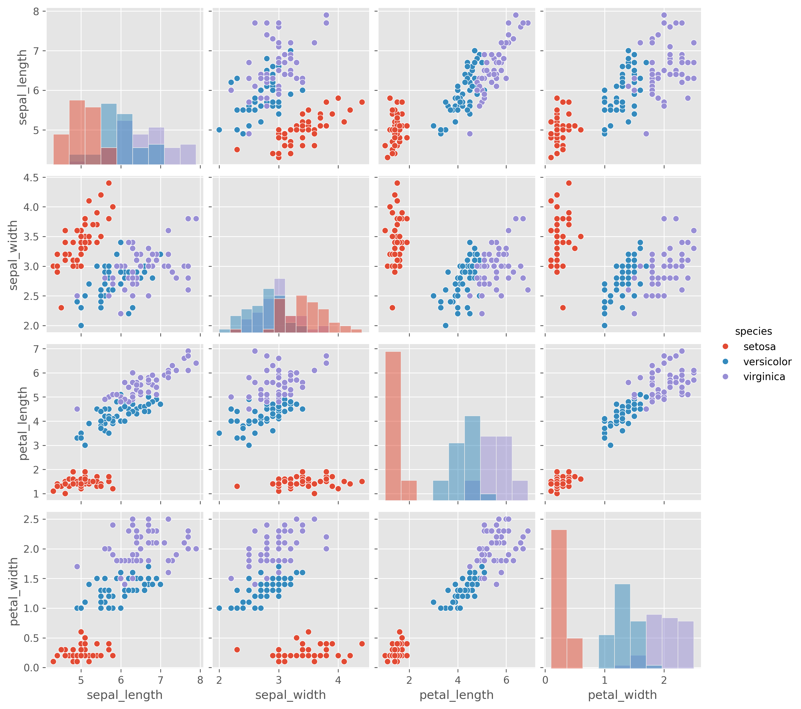
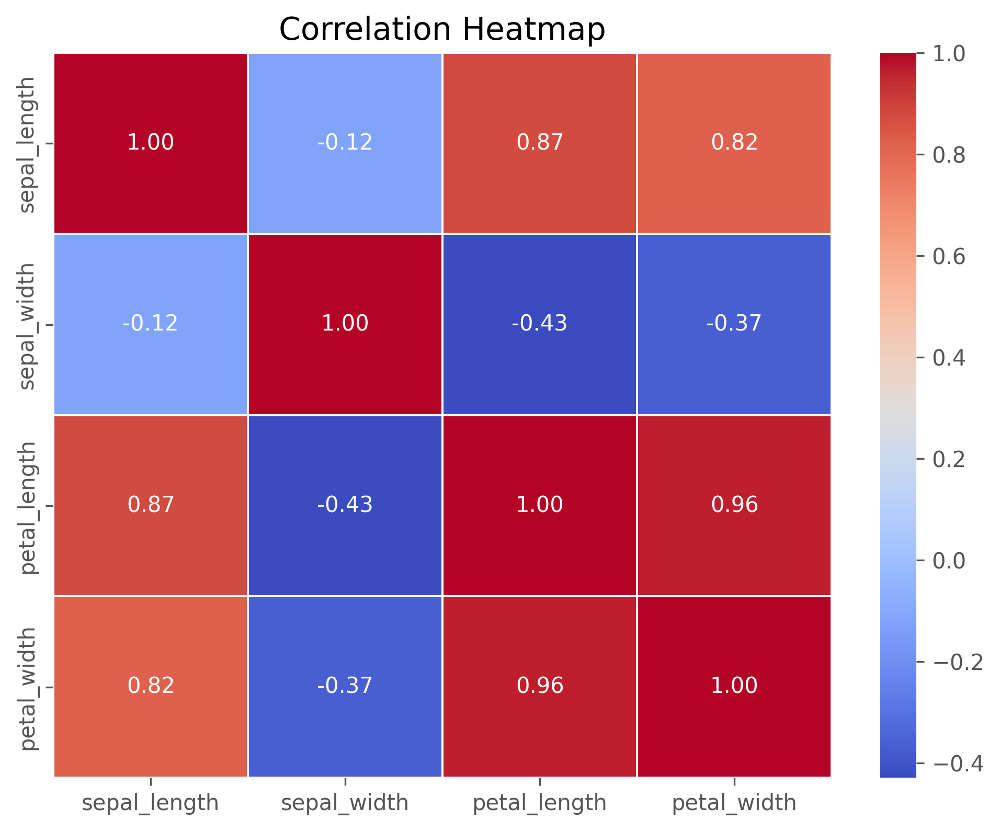
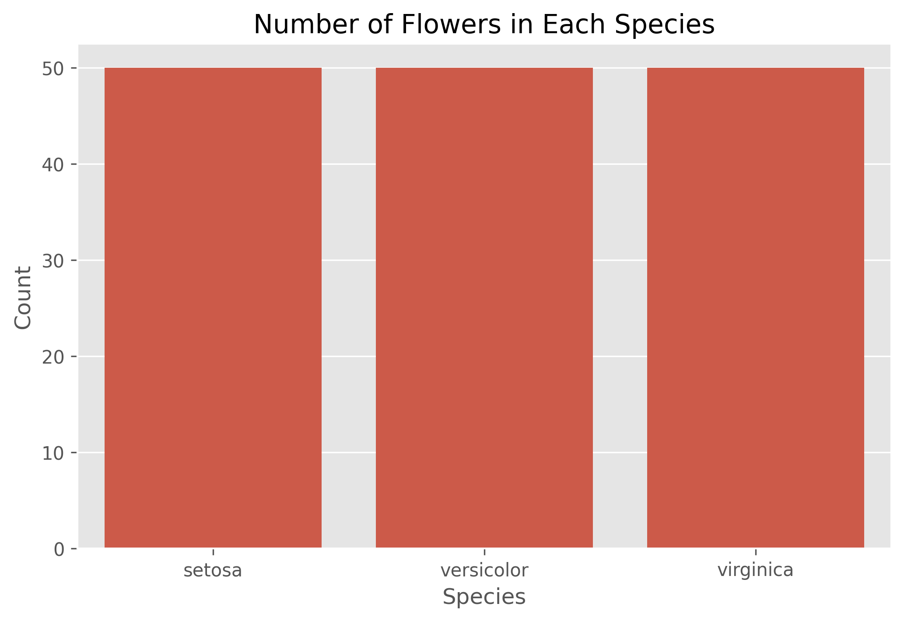
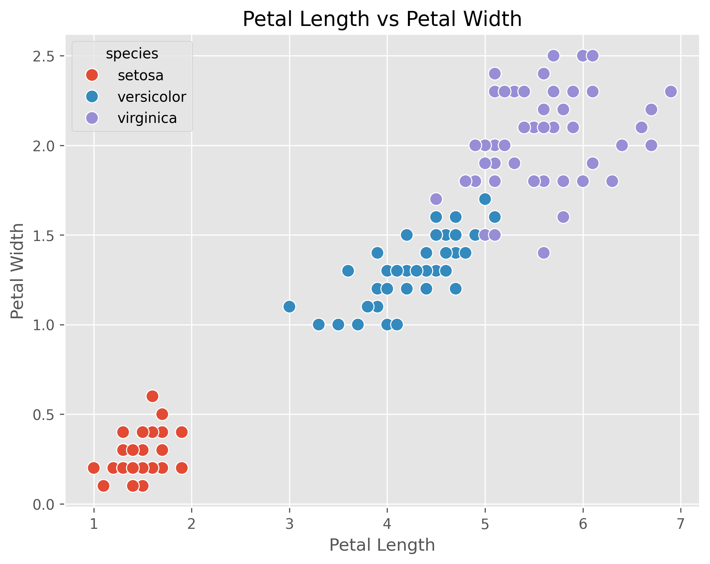
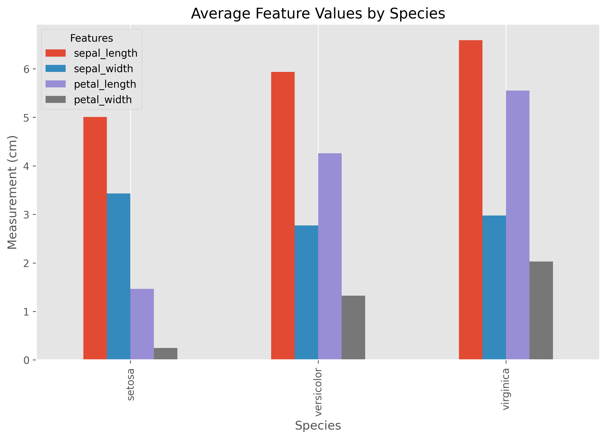

# Exploring the Iris Dataset

A comprehensive Exploratory Data Analysis of the famous Iris dataset using **Python**, **Pandas**, **Seaborn**, and **Matplotlib**.

## Project Overview

The Iris dataset is one of the most widely used datasets in statistics and machine learning. It contains measurements of iris flowers from three different species:

* Setosa
* Versicolor
* Virginica

The objective of this project is to explore the dataset through descriptive statistics and data visualization to understand the characteristics of each species and identify relationships among the numerical features.

---

## Technologies Used

* Python
* Pandas
* Seaborn
* Matplotlib
* Jupyter Notebook

---

## Analysis Performed

* Data Loading and Inspection
* Data Cleaning and Validation
* Descriptive Statistics
* Species Distribution Analysis
* Univariate Analysis

  * Histograms
  * Box Plots
* Bivariate Analysis

  * Pairplot
  * Scatter Plots
  * Regression Plot
* Correlation Analysis

  * Correlation Matrix
  * Heatmap
* Species Comparison
* Key Insights
* Final Conclusion

---

## Project Structure

```text
exploring-the-iris-dataset/
│
├── Exploring_the_Iris_Dataset.ipynb
├── README.md
├── requirements.txt
├── .gitignore
└── images/
```

---

## Sample Visualizations

### Pairplot



---

### Correlation Heatmap



---

### Species Distribution



---

### Petal Length vs Petal Width



---

### Average Feature Values by Species



---

## Key Findings

* The dataset contains **150 observations** across **three iris species**.
* There are **no missing values**, making the dataset clean and ready for analysis.
* The dataset is **perfectly balanced**, with 50 samples for each species.
* **Petal length** and **petal width** are the most informative features for distinguishing species.
* **Setosa** forms a clearly distinct cluster and is almost linearly separable from the other two species.
* **Versicolor** and **Virginica** overlap slightly, particularly in sepal measurements.
* **Petal length** and **petal width** exhibit a very strong positive correlation.

---

## Dataset

The dataset is loaded directly from the Seaborn library using:

```python
iris = sns.load_dataset("iris")
```